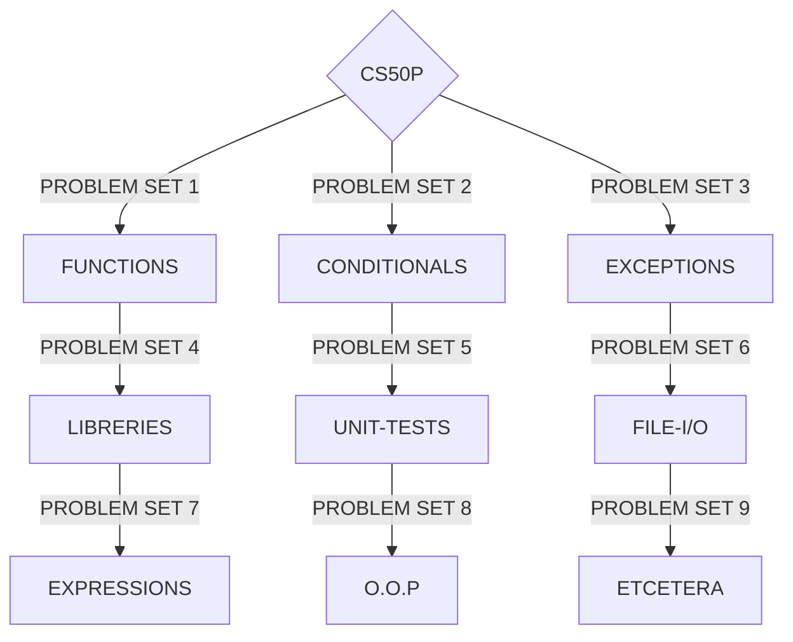

# CS50P 
Harvard's CS50: Introduction to Programming with Python

_My solutions to the problems of the class "Introduction to programming with Python"_

_I solved the exercises using algorithms based on computer science fundamentals and not so much on Python "tricks" or "shortcuts", this to train logic. That is why you can see lines and lines of code in something that Python as a language would take a few lines_

