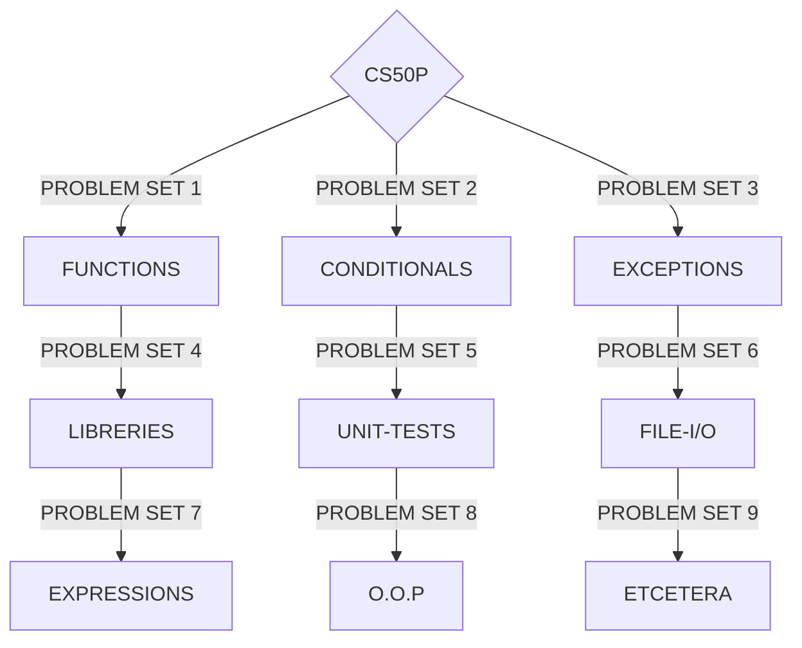

# CS50P 

```mermaid
graph TD
    A{CS50P}
    A -->|PROBLEM SET 1| FUNCTIONS -->|PROBLEM SET 4| LIBRERIES -->|PROBLEM SET 7| EXPRESSIONS
    A -->|PROBLEM SET 2| CONDITIONALS -->|PROBLEM SET 5| UNIT-TESTS -->|PROBLEM SET 8| O.O.P
    A -->|PROBLEM SET 3| EXCEPTIONS -->|PROBLEM SET 6| FILE-I/O -->|PROBLEM SET 9| ETCETERA
```

